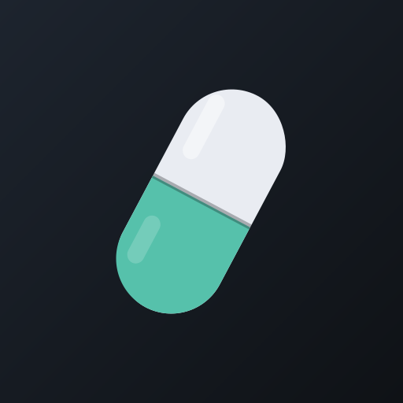
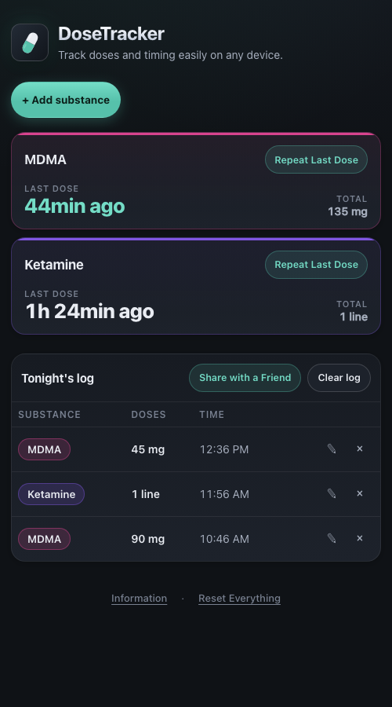

  

<h1 align="center">DoseTracker</h1>

  A free, private dose &amp; timing tracker — built as a harm-reduction tool for nights out.

  <strong><a href="https://dosetracker.github.io">dosetracker.github.io</a></strong>

---

## What it does

DoseTracker helps you keep track of **what you've taken, how much, and — most importantly — how long ago**. Each substance gets a card with a running "time since last dose" front and center.

- ⏱️ **Time since last dose** is the headline number on every card
- ➕ Log a dose in two taps; **"Repeat Last Dose"** for one
- 🧾 A simple log of tonight's doses, with per-substance totals
- 🌙 Designed around **one night at a time** — on your next visit the app offers a fresh start instead of piling up history
- 📤 **Share as image**: send your log to a friend, or show it to medical staff if you ever need help — a timestamped list of what was taken is exactly what they ask for

  

## Private by design

Your data is nobody's business but yours:

- **No server, no account, no analytics.** Everything lives in your browser's local storage, on your device. Nothing is ever uploaded.
- **No history hoarding.** The app encourages clearing the log after each night; deletions take effect immediately (with a brief Undo).
- **Works fully offline.** After the first visit, it loads instantly with no network requests at all — nothing to intercept, nothing to log.
- Anyone opening the same link gets their own empty copy. Your entries are never visible to anyone else.

## Install it like an app

DoseTracker is a PWA (progressive web app) — visit once, keep it forever:

- **iPhone / iPad:** open [dosetracker.github.io](https://dosetracker.github.io) in Safari → Share → **Add to Home Screen**
- **Android:** open it in Chrome → menu → **Install app**
- **Desktop:** click the install icon in the address bar (Chrome/Edge)

Once installed it launches fullscreen from your home screen and works with no internet connection.

## Tech

- A single `index.html` — vanilla HTML, CSS, and JavaScript
- No framework, no build step, no dependencies, no CDN calls
- A small service worker (`sw.js`) for offline caching
- Hosted on GitHub Pages

## Disclaimer

DoseTracker is a logging tool, not medical advice. It doesn't judge, warn, or recommend doses; it just helps you remember. If you or someone near you feels seriously unwell, contact emergency services. Honest information about what was taken helps medics act fast.
